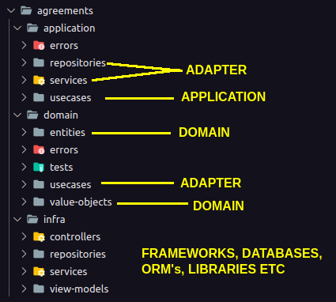

In general the main idea of this repository isn't about what the project does but how it was built. 

It's a mix of some Clean Architecture **(CA)** and Domain Driven Design **(DDD)** ideas. 

## Purpose
`Why?`. Well, in my option, CRUD's are only worth it for very small projects. A simple form here or there. Other than that it's really interesting to consider the adoption of other development alternatives. 

One of these are starting from a domain. Instead of starting the project by the database, tables, columns, ORM and frameworks, you're gonna let all this decisions as far as possible. They're just details. 

## Project
The structure follows **CA** where it emphasizes separation of concerns and the separation of software components into distinct layers. The inner layers communicates with the outer layers through interfaces.

The domain in the other hand is mostly following **DDD** with entities and value-objects. **DDD** entities has a well solid concept better than **CA**, which is too abstract imo, that's why I've chosen **DDD** entities. 

One of the coolest thing is where the framework stands. It's completely detached from my domain. So I can change from NestJS to Express, for instance, and the domain won't be affected. 

The main goal is to reach maintainability.

`Note:` Folder structure and names has nothing to do with architecture. You might build everything into a single folder or even put your name on em and still be following Clean Architecure, Domain Driven Design, Ports & Adapters, etc.

So the project structure ended up like this.

## To conclude ...
- Structure follows Clean Architecture
- Domain follows Domain Driven Design
- Unit and integration tests (mandatory !)